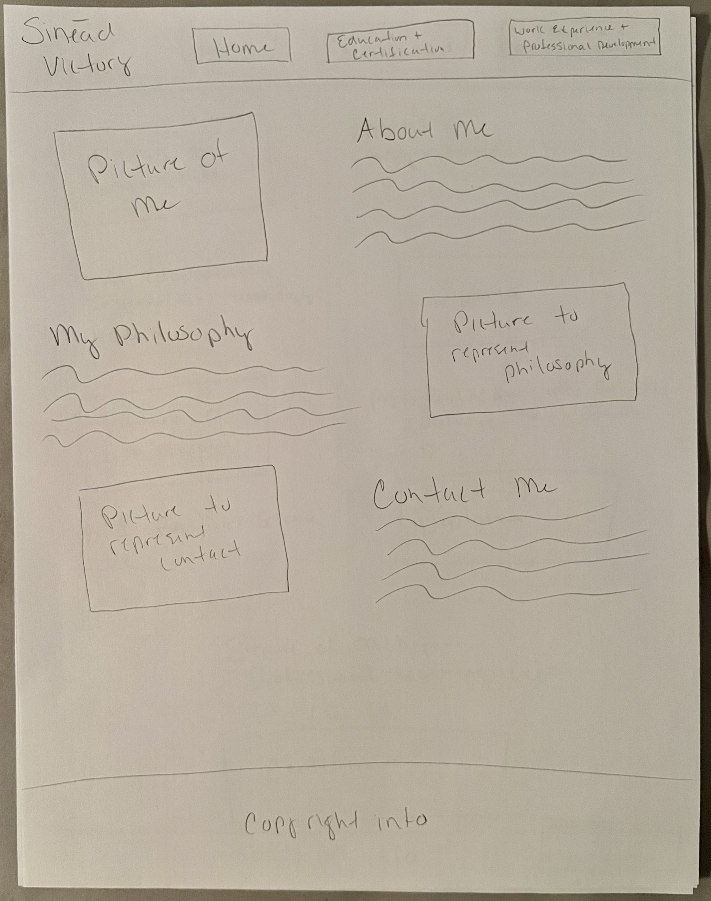
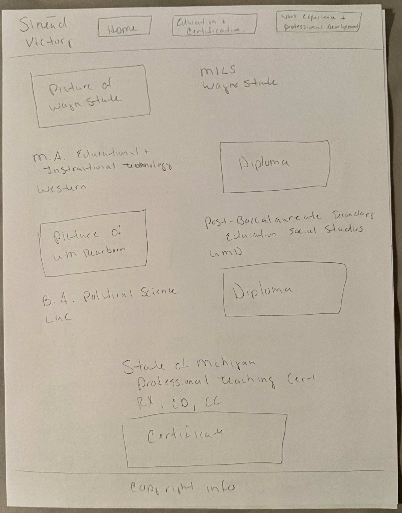
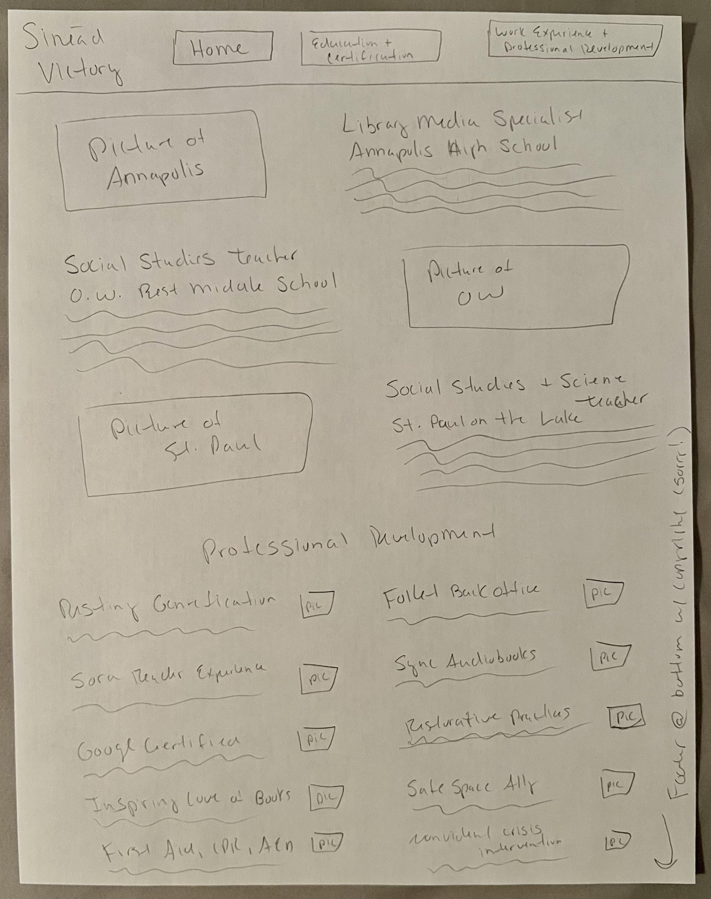

# Sinead Victory's INF 6420 Project

A portfolio site showcasing my work.

## Wireframes

Wireframes for the planned layout of my project.

### Home Page

Header - Will include my name and the navigation menu

Navigation Menu - Will include links to the home, education and certification, and work experience and professional development pages

Main Content - Will have about me, my philosophy, and contact me sections

Footer - Will include copyright information

### Education and Certification Page

Header - Will include my name and the navigation menu

Navigation Menu - Will include links to the home, education and certification, and work experience and professional development pages

Main Content - Will have information about my educational background and state certification and endorsements

Footer - Will include copyright information

### Work Experience and Professional Development Page

Header - Will include my name and the navigation menu

Navigation Menu - Will include links to the home, education and certification, and work experience and professional development pages

Main Content - Will have information about my work and professional development experiences

Footer - Will include copyright information
